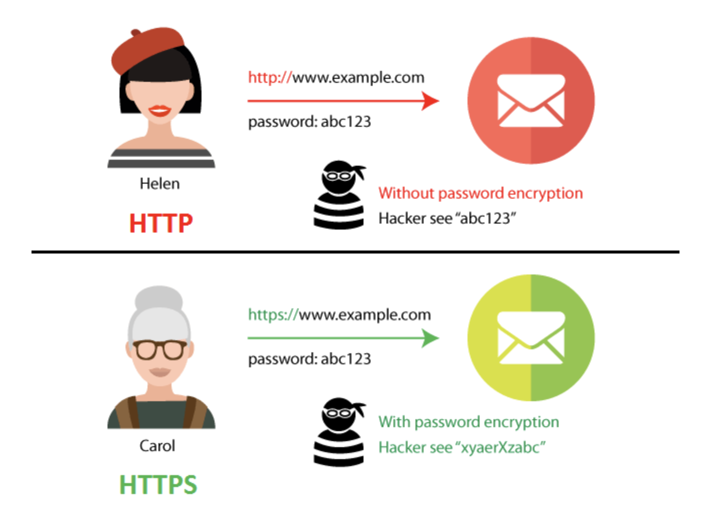

# HTTP vs HTTPS

HTTP와 HTTPS의 차이를 알아보자

 

## 개념

### HTTP

HTTP는 서로 다른 시스템들 사이에서 통신을 주고받게 해주는 가장 기초적인 프로토콜이다.

웹 서핑을 할 때 서버에서 자신의 브라우저로 데이터를 전송해 주는 용도로 가장 많이 사용된다.

- 프로토콜 : 컴퓨터 내부에서, 또는 컴퓨터 사이에서 데이터의 교환 방식을 정의하는 규칙 체계이다.

### HTTPS

HTTPS는 HTTP 프로토콜의 문제점인 암호화를 SSL(보안 소켓 계층)을 사용하여 해결하였다.

 

## HTTP와 HTTPS

결국 HTTP와 HTTPS의 차이는 SSL이다.

SSL은 서버와 브라우저 사이에 안전하게 암호화된 연결을 만들 수 있게 도와주고

서버 브라우저가 민감한 정보를 주고받을 때 이것이 도난당하는 것을 막아준다.

SSL 인증서는 사용자가 사이트에 제공하는 정보를 암호화하는데 쉽게 말해서 데이터를 암호로 바꾼다고 생각하면 쉽다.

이렇게 전송된 데이터는 중간에서 누군가 훔쳐 낸다고 하더라도 데이터가 암호화되어있기 때문에 해독할 수 없다.
