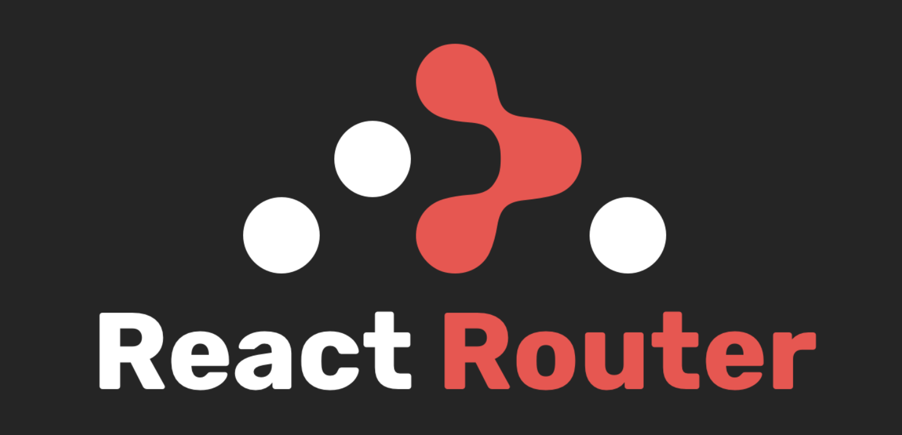
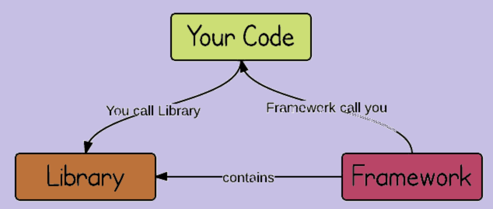

# Library vs FrameWork

## 개념

### Library

라이브러리란 특정 기능에 대한 도구 또는 함수들의 집합이다.

프로그래머가 어떠한 기능을 수행하기 위해서 도움을 주는 또는 필요한 것을 제공해주는 역할을하는 것이다.

Library에는 React와 Router, Axios가 있다.

 

 

### FrameWork

프레임워크는 뼈대나 기반구조를 뜻한다.

프로그래밍을 진행할 때 필수적인 코드, 알고리즘 등과 같이 어느 정도의 구조를 제공해주기 때문에

이러한 프레임워크들을 사용하여 프로그램을 개발하면된다.

FrameWork에는 Spring과 Django가 있다. 

 

 

## 차이

 

 

프레임워크와 라이브러리의 차이점은 흐름을 누가 지니고 있냐의 차이이다.

프레임워크는 전체적인 흐름을 자체적으로 가지고 있어 프로그래머는 그 안에서 필요한 코드를 작성한다.

반면에 라이브러리는 프로그래머가 전체적인 흐름을 가지고 있어 라이브러리를 자신이 원하는 기능을 구현하고

싶을 때 가져다 사용할 수 있다.
